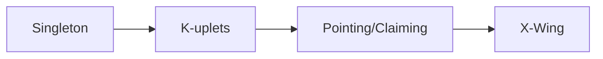
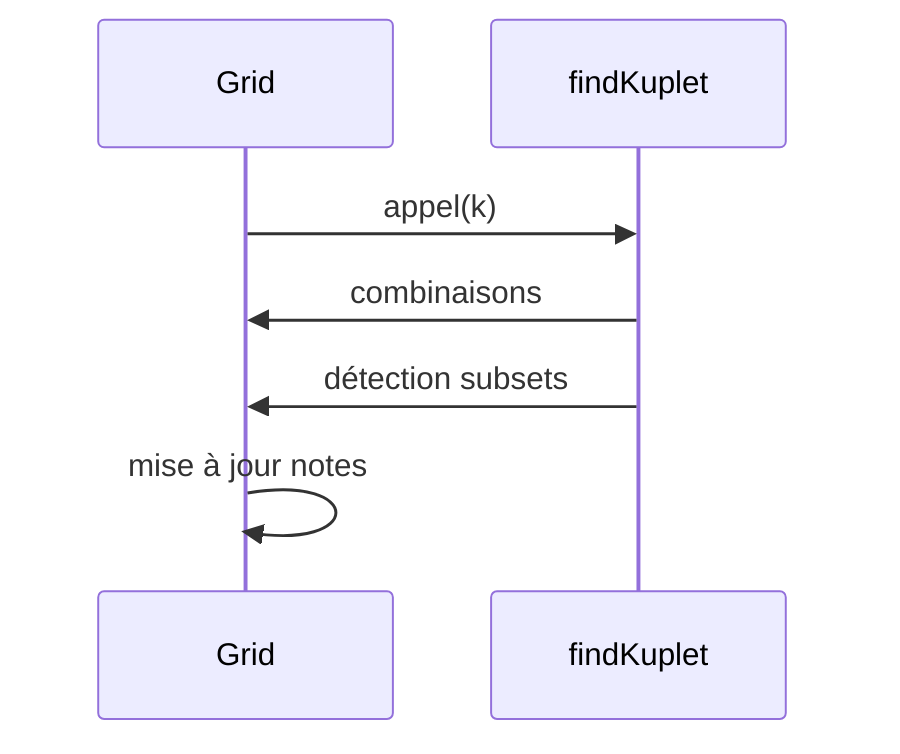
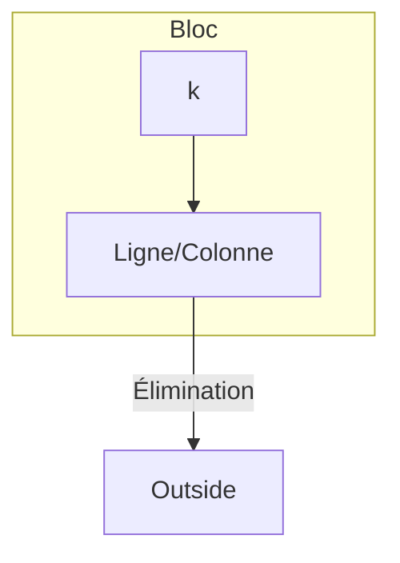
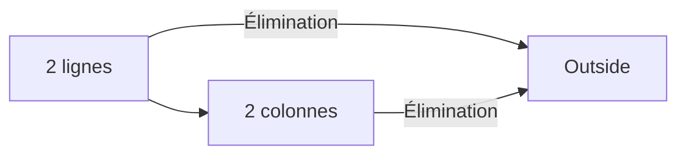
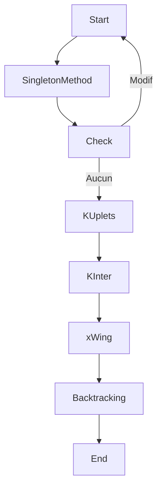

# Sudoku Solver Project

**Auteurs** : Maxime MARCHIVE, Ronan PLUTA FONTAINE, Raphael SIMON, Diewertje VAN DAM 

---

## 1. Introduction

Ce projet implémente un solveur de Sudoku en C qui enchaîne les techniques de résolution humaines, avant de recourir à un backtracking en dernier recours. Chaque règle de base implémentée est regroupée dans des mécanismes génériques (k-uplets, k-intersections, k-wings).

---

## 2. Structure du projet

* **main.c** : point d’entrée, lecture de la grille, boucle d’application des règles, retour au backtracking si nécessaire, affichage final.
* **sudoku.c / sudoku.h** : implémentation des fonctions principales :

  * `SingletonMethod()`
  * `findKuplet(grid, k)` (naked + hidden subsets)
  * `boxKReduction_line(grid, k)` et `boxKReduction_col(grid, k)` (pointing/claiming)
  * `xWing(grid)`
  * `solveSudoku()` (backtracking)
* **access.c / access.h** : gestion des cases, notes de candidats, voisinages (ligne, colonne, bloc).
* **utils.c / utils.h** : affichage de la grille (`printGrid`), des notes (`printNotes`), et fonctions utilitaires.
* **types.c / types.h** : définitions des structures (`sudoku`, `case_t`) et constantes.

---

## 3. Règles de base réellement implémentées

Le solveur prend en charge :

1. **Singleton** : remplissage automatique des cases à unique candidat (`SingletonMethod`).
2. **Naked/Subsets** et **Hidden Subsets** : détectés par `findKuplet(grid, k)`, pour k=1…9.
3. **Pointing Pairs/Triples** & **Claiming** : unifiés dans `boxKReduction_line` et `boxKReduction_col`.
4. **X-Wing** : pattern sur deux lignes/colonnes via `xWing(grid)`.

> **Non implémentées** : Swordfish, Jellyfish, Unique Rectangle, Coloring, Chains, Y-Wing, etc.



---

## 4. Regroupement en mécanismes génériques

### 4.1 k-uplets

* **Fonction** : `findKuplet(grid, k)`
* Couvre naked + hidden subsets pour toute taille k.
* Génère combinaisons, détecte subsets, met à jour notes ou remplit cases.



### 4.2 k-intersections

* **Fonctions** : `boxKReduction_line(grid, k)` & `boxKReduction_col(grid, k)`
* Unifient Pointing et Claiming pour k=1…9.



### 4.3 k-wings

* **Fonction** : `xWing(grid)` (k=2)
* Détecte le pattern X-Wing, élimine candidats dans les coins opposés.



---

## 5. Orchestration et backtracking

Le `main()` suit ce flux :

1. `SingletonMethod()`
2. Boucle `findKuplet(..., k)` pour k = 1…9
3. Boucle `boxKReduction_line(..., k)` / `boxKReduction_col(..., k)` pour k = 1…9
4. `xWing()`
5. Si aucune modification, `solveSudoku()` (backtracking)



---

## 6. Personnaliser et exécuter un Sudoku

1. **Définir la grille** dans `main.c` :

   ```c
   short unsigned int maGrille[9][9] = {
     {5,3,0, 0,7,0, 0,0,0},
     {6,0,0, 1,9,5, 0,0,0},
     // … vos 9 lignes
   };
   ```

2. **Sélectionner la grille** : dans `main()`, remplacer l’ancien tableau par `maGrille` :

   ```c
   set_value_of_case(&tab[i][j], maGrille[i][j]);
   ```

3. **Compiler et exécuter** :

   ```bash
   gcc -std=c11 -Wall -Wextra -I. *.c -o Sudoku
   ./Sudoku
   ```

---

## 7. Compilation et exécution

### En ligne de commande Linux uniquement

```bash
# Installer build-essential si besoin
sudo apt install build-essential

# Compiler le projet
gcc -std=c11 -Wall -Wextra -I. *.c -o Sudoku

# Exécuter le solveur
./Sudoku
```

## Licence

Projet académique - Université de Poitiers (2025)
